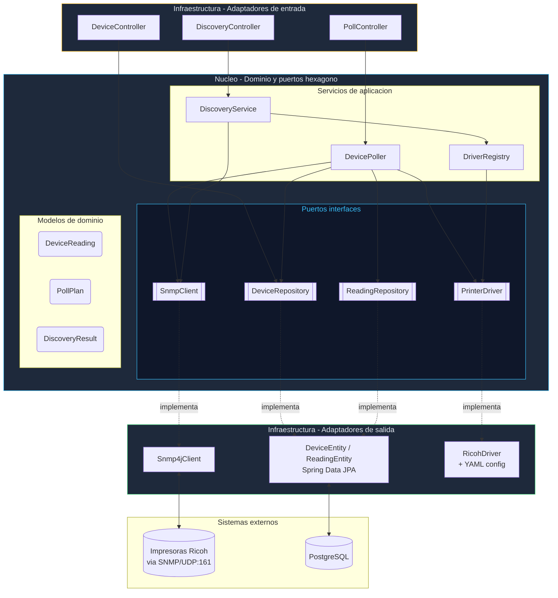
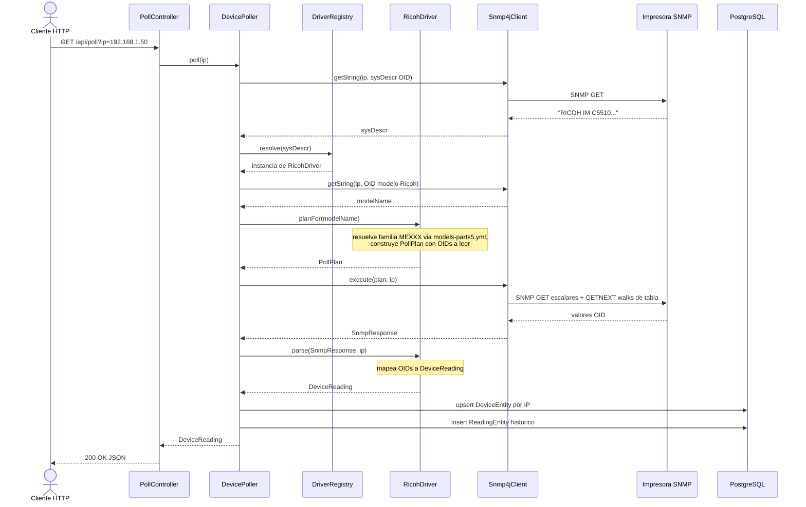
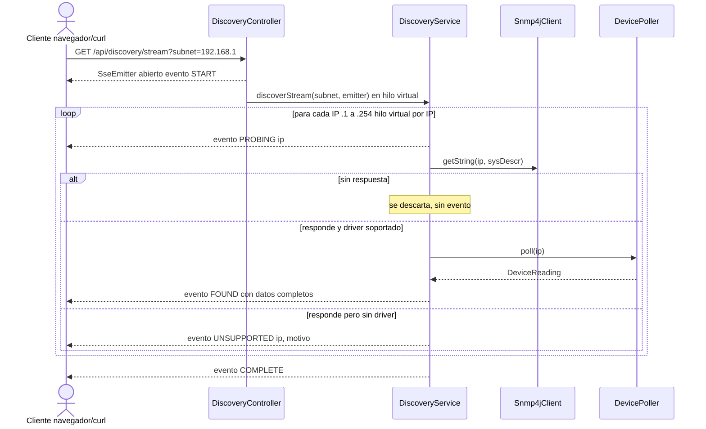
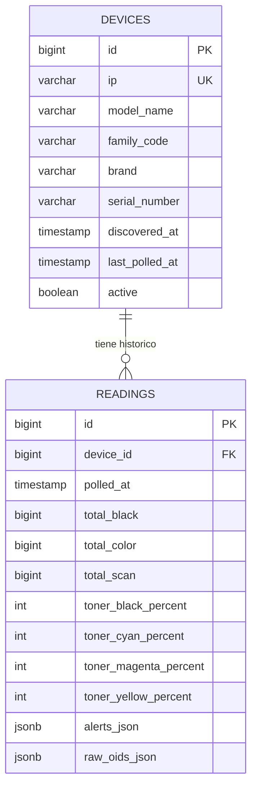

# NMS Printer Monitor — proyectoNMSRicohV3

Sistema de monitorización de flotas de impresoras/multifuncionales **Ricoh** vía **SNMP**, construido con **Spring Boot 3 + Java 21**, siguiendo **arquitectura hexagonal** (ports & adapters). Descubre dispositivos en una subred, identifica el modelo, aplica el perfil OID correspondiente (a partir de un MIB propietario documentado en YAML), sondea sus contadores/consumibles/alertas por SNMP y persiste el histórico en PostgreSQL.

---

## Tabla de contenidos

1. [Qué hace](#qué-hace)
2. [Arquitectura hexagonal](#arquitectura-hexagonal)
3. [Flujo de datos](#flujo-de-datos)
4. [Estructura del proyecto](#estructura-del-proyecto)
5. [Modelo de datos](#modelo-de-datos)
6. [Cómo arrancar la aplicación](#cómo-arrancar-la-aplicación)
7. [Endpoints expuestos](#endpoints-expuestos)
8. [El "cerebro" Ricoh: perfiles YAML](#el-cerebro-ricoh-perfiles-yaml)
9. [Tests](#tests)
10. [Estado actual y limitaciones conocidas](#estado-actual-y-limitaciones-conocidas)

---

## Qué hace

En términos sencillos, la aplicación hace tres cosas:

1. **Descubre** (`Discovery`): recorre una subred IP (`x.x.x.1` a `x.x.x.254`) preguntando por SNMP a cada IP "¿quién eres?" (`sysDescr`). Si contesta y es una Ricoh/Aficio soportada, la marca como encontrada.
2. **Sondea** (`Poll`): para un dispositivo concreto, decide qué OIDs SNMP hay que leer según su modelo (plan de sondeo), los lee, y construye una "foto" (`DeviceReading`) con contadores de páginas, niveles de tóner, bandejas de papel y alarmas activas.
3. **Persiste**: guarda/actualiza el dispositivo en la tabla `devices` y añade una fila histórica en `readings` cada vez que se sondea, permitiendo reconstruir la evolución en el tiempo (consumo, tóner, etc.).

La complejidad principal no está en el CRUD, sino en que **cada familia de impresora Ricoh expone datos distintos por OIDs distintos** (una IM C5510 no es igual que una SP 8300DN). Esa complejidad se aísla en un plugin (`RicohDriver`) configurado por dos archivos YAML, sin tocar el núcleo de la aplicación.

---

## Arquitectura hexagonal

El proyecto separa el **dominio** (reglas de negocio puras, sin frameworks) de los **adaptadores** (SNMP real, JPA/PostgreSQL, REST). El dominio solo conoce **interfaces** (`ports`); quién las implementa es intercambiable.



**Regla de dependencia**: las flechas de implementación (`-.implementa.->`) siempre apuntan *hacia dentro* del hexágono. `core` no importa nada de `infrastructure` salvo los propios puertos y los DTOs de transporte (`SnmpResponse`), y no depende de Spring Data ni de SNMP4J directamente — solo de sus propias interfaces.

| Paquete | Rol | Ejemplos |
|---|---|---|
| `core.domain` | Modelos inmutables (records), sin anotaciones de framework | `DeviceReading`, `PollPlan`, `CounterSnapshot`, `DiscoveryResult` |
| `core.ports` | Interfaces que el dominio necesita, implementadas fuera | `SnmpClient`, `PrinterDriver`, `DeviceRepository`, `ReadingRepository` |
| `core.services` | Orquestación de casos de uso | `DevicePoller`, `DiscoveryService`, `DriverRegistry` |
| `infrastructure.snmp` | Adaptador SNMP real (SNMP4J) | `Snmp4jClient`, `SnmpResponse` |
| `infrastructure.persistence` | Adaptador JPA/PostgreSQL | `DeviceEntity`, `ReadingEntity`, `ReadingMapper` |
| `infrastructure.web` | Adaptador REST (entrada) | `DeviceController`, `DiscoveryController`, `PollController` |
| `plugins.ricoh` | Adaptador de `PrinterDriver` específico de marca | `RicohDriver` + `config/*` (carga de YAML) |

### ¿Por qué "plugin" y no simplemente "adaptador"?

`PrinterDriver` está pensado para tener **varias implementaciones**, una por marca (Ricoh, y en el futuro quizá HP, Kyocera...). `DriverRegistry` las recibe todas inyectadas por Spring (`List<PrinterDriver>`), las ordena por `@Order`, y elige la primera cuyo método `supports(sysDescr)` devuelva `true`. Añadir soporte para otra marca no debería requerir tocar `DevicePoller` ni `DiscoveryService`: basta con crear un nuevo paquete `plugins.<marca>` con su propio driver.

---

## Flujo de datos

### 1. Sondeo de un dispositivo conocido (`GET /api/poll`)



### 2. Descubrimiento de red en tiempo real (`GET /api/discovery/stream`, SSE)



La versión SSE usa **hilos virtuales** (`Executors.newVirtualThreadPerTaskExecutor()`, Java 21) para lanzar hasta 254 sondeos concurrentes por subred sin agotar hilos de plataforma, y empuja eventos incrementales al cliente en vez de esperar a que termine todo el escaneo (a diferencia de `GET /api/discovery/scan`, que es bloqueante y devuelve la lista completa al final).

---

## Estructura del proyecto

```
src/main/java/com/tuempresa/nms/
├── NmsPrinterMonitorApplication.java     # @SpringBootApplication + @EnableAsync
│
├── core/                                  # Hexagono: dominio + puertos + servicios
│   ├── domain/                            # Records inmutables (sin anotaciones de framework)
│   │   ├── DeviceReading.java             # "Foto" completa de un sondeo
│   │   ├── PollPlan.java                  # Que OIDs leer para un modelo dado
│   │   ├── DiscoveryResult.java           # Resultado de probar una IP
│   │   ├── CounterSnapshot / ConsumableSnapshot / PaperTray / StatusAlert / TableWalk
│   ├── ports/                              # Interfaces (contratos)
│   │   ├── SnmpClient.java                # Como hablar SNMP
│   │   ├── PrinterDriver.java             # Como interpretar una marca/modelo
│   │   ├── DeviceRepository.java          # JpaRepository<DeviceEntity>
│   │   └── ReadingRepository.java         # JpaRepository<ReadingEntity>
│   └── services/
│       ├── DevicePoller.java              # Orquesta un sondeo completo + persistencia
│       ├── DiscoveryService.java          # Orquesta el escaneo de subred (bloqueante y SSE)
│       ├── DriverRegistry.java            # Elige el PrinterDriver correcto
│       └── UnsupportedDeviceException.java
│
├── infrastructure/                        # Adaptadores (detalles tecnicos)
│   ├── snmp/
│   │   ├── Snmp4jClient.java              # Implementa SnmpClient con la libreria SNMP4J
│   │   └── SnmpResponse.java              # DTO: OIDs escalares + filas de tabla walkeadas
│   ├── persistence/
│   │   ├── DeviceEntity.java              # Tabla `devices`
│   │   ├── ReadingEntity.java             # Tabla `readings` (alerts/raw OIDs en JSONB)
│   │   └── ReadingMapper.java             # DeviceReading (dominio) -> ReadingEntity (JPA)
│   └── web/
│       ├── DeviceController.java          # /api/devices
│       ├── DiscoveryController.java       # /api/discovery
│       └── PollController.java            # /api/poll
│
└── plugins/ricoh/                         # Adaptador de PrinterDriver para Ricoh
    ├── RicohDriver.java                   # Implementa supports/planFor/parse
    └── config/
        ├── RicohConfigLoader.java         # Parsea los YAML con Jackson
        ├── FamilyProfile.java             # DTO de una familia (ME001, ME002...)
        └── RicohOidConfig.java            # DTO de OIDs genericos (id/status)

src/main/resources/
├── application.yml                        # Config Spring: datasource, puerto, SNMP
├── ricoh_oid_5.yml                        # MIB Ricoh Parte 5 estructurado por familia (ME001...ME0xx)
├── models-parts5.yml                      # Mapa "nombre de modelo comercial" -> "codigo de familia"
└── static/index.html                      # Panel HTML simple (dashboard visual, standalone)
```

---

## Modelo de datos



- **`devices`**: una fila por IP (`findByIp` es la clave de upsert). Se actualiza en cada sondeo con el último modelo/familia/serie conocidos.
- **`readings`**: histórico append-only. Cada sondeo genera una fila nueva, indexada por `(device_id, polled_at)` para consultas de series temporales.
- `alerts_json` y `raw_oids_json` se guardan como **JSONB** en PostgreSQL: el primero con las alarmas activas parseadas (`StatusAlert`), el segundo con el volcado crudo de todos los OIDs escalares leídos (útil para depurar sin tener que volver a sondear el equipo).

---

## Cómo arrancar la aplicación

### Opción A — Todo con Docker Compose (recomendado)

Requiere Docker y Docker Compose. Levanta la app, PostgreSQL y pgAdmin:

```bash
docker compose up --build
```

Esto arranca:

| Servicio | Puerto host | Notas |
|---|---|---|
| `app` (Spring Boot) | `8080` | Espera a que `db` esté "healthy" |
| `db` (PostgreSQL 16) | `5432` | Base `nms_printers`, usuario `nms_user` |
| `pgadmin` | `8090` | Login: `admin@admin.com` / `admin` |
| `grafana` *(opcional)* | `3000` | Solo con `docker compose --profile monitoring up`; preparado para futuros dashboards, sin datasource provisionado aún |

Verifica que arrancó:
```bash
curl "http://localhost:8080/api/devices"
```

### Opción B — Local, con PostgreSQL propio

1. Levanta un PostgreSQL accesible y crea la base:
   ```sql
   CREATE DATABASE nms_printers;
   CREATE USER nms_user WITH PASSWORD 'nms_pass';
   GRANT ALL PRIVILEGES ON DATABASE nms_printers TO nms_user;
   ```
2. Ajusta `src/main/resources/application.yml` si tu host/usuario/contraseña difieren.
3. Compila y ejecuta (requiere JDK 21 y Maven):
   ```bash
   mvn clean package -DskipTests
   java -jar target/nms-printer-monitor-0.1.0-SNAPSHOT.jar
   ```
   o directamente en modo desarrollo:
   ```bash
   mvn spring-boot:run
   ```

La app queda escuchando en `http://localhost:8080`. `spring.jpa.hibernate.ddl-auto=update` crea/actualiza las tablas automáticamente al arrancar — no hay migraciones Flyway/Liquibase en este proyecto.

### Variables de configuración relevantes

| Propiedad | Variable de entorno | Por defecto | Descripción |
|---|---|---|---|
| `nms.snmp.community` | `NMS_SNMP_COMMUNITY` | `public` | Community string SNMP v2c |
| `nms.snmp.timeout` | `NMS_SNMP_TIMEOUT` | `3000` (ms) | Timeout por petición SNMP |
| `nms.snmp.retries` | — | `2` | Reintentos por petición SNMP |
| `nms.discovery.concurrent-ips` | — | `50` | *(declarada, no usada aún — ver limitaciones)* |
| `nms.discovery.ping-timeout` | — | `2000` | *(declarada, no usada aún)* |
| `spring.datasource.url` | `SPRING_DATASOURCE_URL` | `jdbc:postgresql://localhost:5432/nms_printers` | Conexión a PostgreSQL |

---

## Endpoints expuestos

Base URL local: `http://localhost:8080`

### `GET /api/poll?ip={ip}`
Sondea **un** dispositivo por IP de forma síncrona y devuelve su lectura completa (contadores, tóner, alertas). También persiste el resultado.

```bash
curl "http://localhost:8080/api/poll?ip=192.168.1.50"
```
```json
{
  "ip": "192.168.1.50",
  "modelName": "IM C5510",
  "serialNumber": "B123P800123",
  "familyCode": "ME070",
  "brand": "Ricoh",
  "polledAt": "2026-09-24T10:15:30Z",
  "counters": { "totalBlack": 45210, "totalColor": 12034, "totalScan": 8021 },
  "consumables": { "tonerBlackPercent": 62, "tonerCyanPercent": 40, "tonerMagentaPercent": 55, "tonerYellowPercent": 71 },
  "paperTrays": [],
  "alerts": [ { "source": "copier", "type": "toner_low", "active": false, "description": "copier:toner_low" } ]
}
```
Si la IP no responde SNMP, devuelve `null` (200 OK con cuerpo vacío) — no hay manejo de error HTTP explícito.

### `GET /api/discovery/scan?subnet={x.x.x}`
Escaneo **bloqueante** de una subred `/24` (254 IPs, `subnet.1` a `subnet.254`). Espera a que terminen todos los sondeos (hilos virtuales) y devuelve la lista completa.

```bash
curl "http://localhost:8080/api/discovery/scan?subnet=192.168.1"
```

### `GET /api/discovery/stream?subnet={x.x.x}` (Server-Sent Events)
Igual que `scan`, pero como **stream SSE**: emite eventos incrementales según se van descubriendo dispositivos, en vez de esperar al final. Ideal para una UI que quiera mostrar progreso en vivo (el `index.html` incluido está pensado para esto).

```bash
curl -N "http://localhost:8080/api/discovery/stream?subnet=192.168.1"
```
Eventos emitidos: `START`, `PROBING` (por cada IP), `FOUND` (con datos completos del sondeo), `UNSUPPORTED` (respondió SNMP pero no hay driver), `COMPLETE`.

### `GET /api/devices`
Lista todos los dispositivos conocidos (ya descubiertos/sondeados alguna vez), tal como están en la tabla `devices`.

### `GET /api/devices/brand/{brand}`
Filtra dispositivos por marca (en la práctica, siempre `"Ricoh"` con el driver actual).

### `GET /api/devices/family/{family}`
Filtra dispositivos por código de familia interno (p. ej. `ME070`).

---

## El "cerebro" Ricoh: perfiles YAML

Todo el conocimiento específico de Ricoh vive en dos archivos de `src/main/resources`, **no en código Java**, para poder ampliar el soporte de modelos sin recompilar:

- **`ricoh_oid_5.yml`**: documenta el MIB privado de Ricoh (Parte 5, V4.330). Define, por cada código de familia `MExxx`, qué `features` tiene (color, multifunción, escáner), y los OIDs de sus contadores (`total_black`, `total_color`, `total_scan`) y niveles de tóner. También incluye OIDs genéricos (identificación, bitmasks de estado) comunes a toda la gama.
- **`models-parts5.yml`**: mapa plano `"nombre comercial del modelo" → "código de familia"` (p. ej. `MP C2003: ME008`). Es lo que permite pasar de "leí por SNMP que el modelo es MP C2003" a "aplica el perfil ME008".

`RicohConfigLoader` parsea ambos con Jackson+YAML al arrancar (`@PostConstruct` en `RicohDriver`), y `RicohDriver` los usa así:

1. **`supports(sysDescr)`**: `true` si el texto contiene `"RICOH"` o `"AFICIO"` (primer filtro, antes de saber el modelo exacto).
2. **`planFor(modelName)`**: resuelve la familia vía `models-parts5.yml`, y con el `FamilyProfile` de esa familia construye un `PollPlan` — solo pide por SNMP los OIDs que ese modelo concreto soporta (p. ej. no pide `total_scan` a una impresora sin escáner).
3. **`parse(SnmpResponse, ip)`**: interpreta los valores crudos devueltos por SNMP según el mismo perfil, con reglas particulares para el tóner (`-2` = no medible, `-100` = casi vacío) y para las alertas (bitmasks de 32 bits, un bit por tipo de alarma).

Añadir soporte para un modelo nuevo de Ricoh que ya encaje en una familia existente es tan simple como añadir una línea a `models-parts5.yml`. Añadir una familia nueva (con OIDs distintos) requiere una entrada nueva `MExxx:` en `ricoh_oid_5.yml`.

---

## Tests

```bash
mvn test
```

| Test | Qué cubre |
|---|---|
| `RicohConfigLoaderTest` | Que los YAML se parsean correctamente a `FamilyProfile` / mapas de modelo |
| `RicohDriverTest` | Resolución de familia a partir de nombre de modelo, limpieza de nombres (`cleanModelName`) |
| `DevicePollerIntegrationTest` | Flujo completo de sondeo con un `SnmpClient` simulado (`Snmp4jClientMock`) y repositorios en memoria |
| `DevicePollerPersistenceTest` | Persistencia real contra un **Testcontainers PostgreSQL** (upsert de `DeviceEntity`, inserción de `ReadingEntity`) |

`InMemoryDeviceRepository` / `InMemoryReadingRepository` permiten testear `DevicePoller` sin base de datos real; `Snmp4jClientMock` sustituye el cliente SNMP real para no depender de hardware físico en los tests unitarios.

---

## Estado actual y limitaciones conocidas

Para que este README sea fiel al código tal cual está hoy, y no a un ideal:

- **Bandejas de papel no implementadas**: `RicohDriver.parsePaperTrays()` devuelve siempre lista vacía (`TODO` en el código); el `PollPlan` sí solicita el walk de tabla `OID_STD_PAPER_CURRENT`, pero el resultado aún no se parsea a `PaperTray`.
- **Trazas de depuración activas**: `DevicePoller.poll()` y `RicohDriver.resolveFamily()` tienen `System.out.println` de depuración (búsqueda de modelo, claves de mapa) que conviene retirar o pasar a `log.debug` antes de producción.
- **Healthcheck del Dockerfile apunta a `/actuator/health`**, pero `spring-boot-starter-actuator` **no** está en las dependencias del `pom.xml` — ese endpoint no existe todavía, por lo que el healthcheck de Docker fallará hasta añadir la dependencia.
- **`nms.discovery.concurrent-ips` y `nms.discovery.ping-timeout`** están declaradas en `application.yml` pero no se leen en ningún `@Value` del código; el paralelismo real del discovery viene fijado por hilos virtuales (uno por IP, sin límite explícito) más el timeout/retries de `nms.snmp.*`.
- **Un solo driver activo (`RicohDriver`, `@Order(1)`)**: la arquitectura está preparada para más marcas (`DriverRegistry` acepta una lista), pero de momento solo hay una implementación de `PrinterDriver`.
- **Sin autenticación**: todos los endpoints REST son públicos; no hay Spring Security configurado en este proyecto.
- **Descubrimiento limitado a `/24`**: el bucle recorre `.1` a `.254` de un prefijo dado como texto (`subnet + "." + i`), no acepta rangos CIDR arbitrarios.
